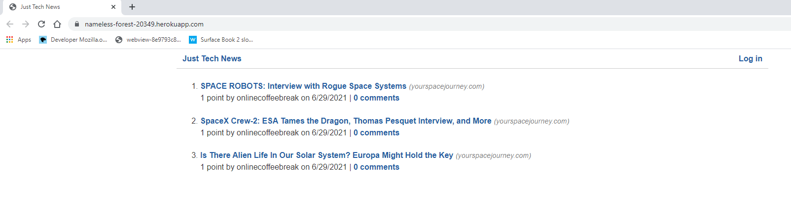

# Just Tech News

## Description

This web application displays links to tech news articles. Users can created an account for free, then upvote and/or add comments to links or add their own. 

## Mock-up

## Website
https://nameless-forest-20349.herokuapp.com/

## Table of Contents

* [Installation](#installation)
* [Usage](#usage)
* [Questions](#questions)
* [License](#license)
* [Tests](#tests)

## Installation

This is a node project, so run npm install

## Usage

npm start

## Tests

Tests are provided using Jest.

## License

https://creativecommons.org/licenses/by-nc/4.0

## Questions

  Contact Chuck Fields  @chuckrfields 
  
  GitHub: [https://chuckrfields.github.io](https://chuckrfields.github.io) 
  
  Email: [info@spacetechcorp.com](mailto:info@spacetechcorp.com)
